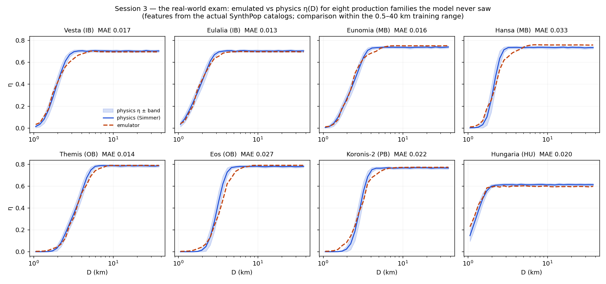

# Simmer


**Sim**ulated survey detections of a synthetic asteroid population — a
forward model of the fully-cryogenic WISE/NEOWISE infrared survey (2010),
plus a machine-learned surrogate that emulates it ~5,000× faster.

> **Scope of this repository.** This is the public engineering snapshot of an
> active research pipeline: the full simulation engine, the ML surrogate, the
> methods documentation, tests, and CI. The **science results** produced with
> it (debiased size-frequency distributions and their implications for
> main-belt collisional evolution) are **withheld pending peer-reviewed
> publication** (paper in preparation); a few cross-references in the methods
> docs point to that private research tree. Code: BSD-3 licensed — please
> cite via `CITATION.cff`.

## What it does

Space-infrared surveys detect asteroids by their heat, but with strong,
size-dependent selection effects. Simmer measures those effects by brute
force: it ingests a synthetic asteroid catalog (position, size, albedo,
NEATM beaming, shape, spin) and **replays the real survey against it** —
propagating each orbit to every frame time, testing the true per-band camera
footprint, computing NEATM thermal fluxes through the WISE relative spectral
response, modulating them with a rotating-ellipsoid lightcurve, adding
photometric noise and bad-pixel losses, applying the 5σ detection cut, and
linking detections into tracklets with the survey's own rules. The fraction
recovered vs injected is the detection efficiency **η(D)**, which debiases
real observed populations: N_true = N_obs / η.

## The pipeline, step by step (methods docs)

| # | Step | Detail doc |
|---|------|-----------|
| 1 | Inputs & synthetic population | [01_inputs_population.md](docs/steps/01_inputs_population.md) |
| 2 | Ephemeris & field of view | [02_ephemeris_fov.md](docs/steps/02_ephemeris_fov.md) |
| 3 | Thermal flux (NEATM + color correction) | [03_thermal_flux.md](docs/steps/03_thermal_flux.md) |
| 4 | Rotational lightcurve modulation | [04_lightcurve.md](docs/steps/04_lightcurve.md) |
| 5 | Detection & tracklet linking | [05_detection_linking.md](docs/steps/05_detection_linking.md) |
| 6 | Detection efficiency η(D) + systematics ledger | *(in the paper)* |
| 7 | Debiasing (N_true = N_obs/η) | [07_debiasing.md](docs/steps/07_debiasing.md) |
| 8 | Size-frequency distribution fit | [08_sfd_fit.md](docs/steps/08_sfd_fit.md) |
| 9 | Small-size extension | [09_small_size_extension.md](docs/steps/09_small_size_extension.md) |
| 10 | Family mass & belt-wide summary | *(in the paper)* |

Engineering highlights: coarse→fine k-d-tree frame matching (avoids the
O(N_obj × N_frame) wall), a precomputed NEATM `(T_ss, α)` lookup surface
(~750× faster than re-integrating, <0.2% error), phase-linked lightcurve
sampling, pluggable survey backends (`simmer.surveys`), and per-family
Monte-Carlo ensembles (50 × 50k-object bootstrap catalogs) for statistical +
systematic error bands on η(D).

## The ML surrogate (`ml/`)

The physics costs ~4 ms per object — fine for one η(D) per population,
disqualifying for per-object corrections or population-inversion loops. So
the simulator was used as a data generator: **150,000 synthetic asteroids
swept across the full parameter box** (`ml/make_training_set.py`; seed,
commit, and ranges in `ml/data/PROVENANCE.md`) and a gradient-boosted
classifier trained to emulate P(detect | D, a, e, i, p_V, beaming, shape,
pole, period).

- **Baselines first**: a logistic model in log D sets the bar — and a
  logistic model with *all* features does no better, showing the signal
  lives in feature interactions (the case for trees).
- **Validation, in escalating honesty**: untouched test set η-MAE **0.016**;
  grouped CV holding out whole semimajor-axis bands **0.039** (vs 0.008 for
  random CV — the honest number, quoted beside the flattering one); and
  per-population η(D) reproduced for eight held-out physics-simulated
  populations across the belt, mean η-MAE **0.020** — including one
  population whose distinctively low efficiency plateau requires having
  learned the survey's distance-dependent sky-coverage geometry.
- **Interpretability that earned its keep**: SHAP analysis independently
  rediscovered the survey physics (albedo ranks near last — a thermal
  survey is reflectivity-blind; beaming, size, and distance dominate), and
  a 400-slice monotonicity audit caught the most *accurate* model producing
  physically impossible slices — so production ships the
  monotonicity-constrained variant. Choose models by use, not leaderboard.
- **Speed**: ~0.7 µs per object, **~5,000×** the physics.
- **API with a trust boundary**: `from ml import predict_eta` returns NaN
  outside the training ranges rather than extrapolating silently
  (`clip="edge"` is the documented opt-in).



## Quickstart (self-contained, ~1 minute)

```bash
pip install -r requirements.txt
python scripts/demo_quickstart.py     # full physics chain on synthetic data
python -m pytest tests/ -q            # 62 tests, no external data needed
```

The demo builds a random 4,000-asteroid population, replays a synthetic
WISE-like cadence against it, and prints the rise-to-plateau η(D) curve —
the survey selection function this pipeline exists to measure.

## Repository layout

```
simmer/     the engine: ephemeris, thermal, lightcurve, detect, geometry,
            efficiency, debias, sfd_fit, allsurvey, pluggable surveys
ml/         the surrogate: training-set generator, model ladder, validation,
            SHAP interpretability, predict_eta() API, provenance
scripts/    run drivers + the quickstart demo
tests/      62 tests, self-contained (synthetic frames; tracked 5k ML sample)
docs/       per-step methods documentation with figures
```

## Requirements

Python ≥3.11; numpy, pandas, scipy, matplotlib, scikit-learn, joblib, shap
(see `requirements.txt`). Tests and demo run with no external data.

## Citation & license

BSD-3-Clause (see `LICENSE`). If you use this code, please cite it — see
`CITATION.cff`. The associated science paper is in preparation; this README
will link it on publication.
