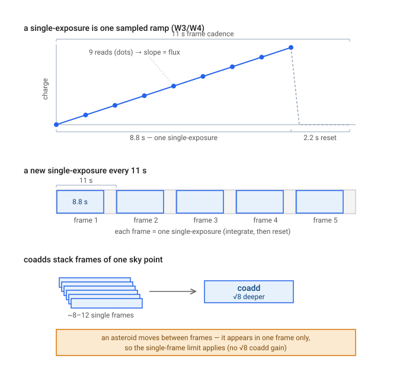

# Step 01 — Inputs & synthetic population

> **Role in the pipeline:** Ingest and validate the SynthPop synthetic Main-Belt catalog, anchor it at a reference epoch, and fix the survey epoch (fully-cryogenic W3+W4 phase) that the whole simulation replays.
> **Implementation:** `simmer/catalog_io.py` (`load_catalog`), `simmer/config.py` (`SimConfig`), `simmer/seeding.py` (`hash01`).
> **↩ Back to the [procedure overview](../../README.md).**

## Purpose
Simmer is the second pipeline downstream of SynthPop: it ingests a `<name>_synthpop.csv` catalog of synthetic Main-Belt asteroids and replays a real sky survey against it to measure the detection efficiency η(D). This step ingests and validates that catalog, anchors its (epoch-free) orbital and rotational phase at a configurable reference epoch, and sets the deterministic random-number seeding and the survey-epoch restriction that all downstream steps depend on. Because the population is statistical rather than a real orbit set, the anchoring fixes phase, not identity.

## Inputs & data sources
- **Synthetic population** — a `<name>_synthpop.csv` catalog emitted by SynthPop's `build_catalog`. Simmer consumes exactly the columns SynthPop emits:
  ```
  id, diam_km, b_over_a, pole_beta_deg, pole_lambda_deg,
  a_au, e, i_deg, node_deg, argperi_deg, M_deg, pV, eta, H
  ```
  These are the orbital elements (`a_au, e, i_deg, node_deg, argperi_deg, M_deg`), diameter (`diam_km`), axis ratio (`b_over_a`), spin pole (`pole_beta_deg, pole_lambda_deg`), geometric albedo (`pV`), IR beaming (`eta`), and absolute magnitude (`H`). SynthPop draws these from scientifically-constrained distributions; each realization is one plausible truth.
- **Validation constraints** (enforced by `catalog_io.load_catalog`): `b_over_a` in (0, 1]; `diam_km > 0`.
- **Run configuration** — `simmer/config.py::SimConfig`, the serialisable run spec. Key fields for this step: `epoch_jd = 2455197.5` (2010-01-01 TDB); `seed = 0`.

## Method & equations
1. **Load & validate.** `catalog_io.load_catalog` reads the `<name>_synthpop.csv`, checks the column contract above, and validates `b_over_a ∈ (0, 1]` and `diam_km > 0`.
2. **Epoch anchoring.** SynthPop draws `M_deg` (mean anomaly) uniformly with no real epoch, so Simmer anchors the elements at the configurable reference epoch `SimConfig.epoch_jd`, default `2455197.5` (2010-01-01 TDB) — the start of the cryo survey. This anchors the uniformly-drawn mean anomaly, fixing orbital/rotational phase only; because the population is statistical it does not confer object identity.
3. **Deterministic seeding.** `simmer/seeding.py::hash01` provides the per-object / per-detection RNG as a splitmix64 hash mapped to the unit interval. It is **batch-invariant**: the result for a given object is identical however objects are distributed across processes, so ensemble members split across workers reproduce exactly. `SimConfig.seed` (default 0) sets the stream.

## Justifications & decisions

### Observing basis — single-exposure, not coadd
Asteroids move ~arcminutes between frames, so they are detected in **individual single-exposure (L1b) frames**, never in the deep multi-frame coadds that static sources benefit from. Each single-exposure is one 8.8 s (W3/W4) charge ramp sampled by 9 reads, one frame every 11 s; ~8–12 separate frames of a sky point combine into a √8-deeper coadd in which a moving asteroid does not appear. Simmer therefore works per single exposure throughout — both the frame matching and the detection limits (W3 = 2.26 mJy, W4 = 15.6 mJy; Wright et al. 2010 §3) are single-frame. This is why the observing basis is single-exposure rather than coadd: moving asteroids do not co-add.

### Survey epoch — restrict to the 4-band (W3+W4) cryogenic phase
Both the observed sample N_obs and the survey simulation are restricted to the **fully-cryogenic 4-band phase** (2010-01-07 – 2010-08-06, ~211 d), excluding the subsequent 3-band cryo phase (W1–W3, W4 exhausted). In the configuration this is the cryo window `CRYO_JD = (2455203.5, 2455415.5)`; W3 and W4 are both required.

The restriction is mandatory, not a convenience: the NEOWISE thermal diameters are derived from a two-band (W3+W4) NEATM fit whose flux calibration applies a **W3−W4 color correction** — the correction factor is selected by matching the measured W3−W4 color to a tabulated grid (Wright et al. 2010, Table 1). Without W4 there is no W3−W4 color and no way to choose the correction (nor a second band to break the NEATM diameter–beaming degeneracy), so the 3-band phase provides no color-corrected diameter and cannot supply N_obs. Extending the window would help sky coverage (it is ~54 d short of the full W3-active span, the source of a small ~5–10% outer-belt coverage residual) but would require N_obs it cannot supply; the 4-band restriction is therefore mandatory for self-consistency. The detection-efficiency plateau it produces (≈0.7–0.8, rising with semimajor axis) is correct sky-coverage geometry, validated against the known population.

## Figures

*Each single exposure is one 8.8 s (W3/W4) charge ramp sampled by 9 reads (one frame every 11 s); ~8–12 frames of a sky point stack into a √8-deeper coadd in which a moving asteroid does not appear — so Simmer works per single exposure throughout.*

## References
- Wright, E. L., et al. 2010, AJ, 140, 1868 — WISE mission; relative system response (RSR) curves; §3 8-frame 5σ sensitivities (44/93/800/5500 µJy in W1–W4), single-exposure limits used here are those × √8; Table 1 color corrections.
- Masiero, J. R., et al. 2011, ApJ, 741, 68 — Main-Belt asteroid diameters/albedos from WISE/NEOWISE (cryo-MBA thermal diameters).
