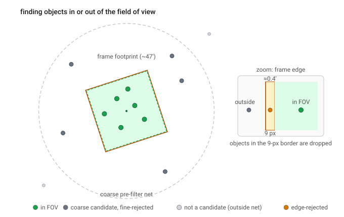

# Step 02 — Ephemeris & field of view

> **Role in the pipeline:** Propagate every synthetic object to each frame time by two-body Kepler, cross-match against the real survey footprints, and compute the observing geometry only for in-frame survivors.
> **Implementation:** `simmer/ephemeris.py` (`solve_kepler`, `elements_to_helio_xyz`, `earth_helio_xyz`, `geocentric_unit`, `geometry_from_positions`), `simmer/geometry.py` (`match_frames`, `_refine`, `_point_in_quad`, `_tangent_plane`, `_inset_scale`).
> **↩ Back to the [procedure overview](../../README.md).**

## Purpose
Stage 1 determines which objects fell within which frames. Each object's orbital elements are propagated to the observation time along a two-body Keplerian orbit, transformed to a geocentric right ascension and declination, and tested for membership in the real survey footprints. To avoid an O(N_obj × N_frame) test the association proceeds **coarse → fine**: a KD-tree net at coarse time-bin centres, then an exact point-in-quadrilateral test on the true per-band footprint corners. The full observing geometry (r, Δ, α, line-of-sight) is computed only for the survivors.

## Inputs & data sources
- **Synthetic elements** — per object from the catalog: `a_au, e, i_deg, node_deg, argperi_deg, M_deg`, anchored at `SimConfig.epoch_jd` (Step 01).
- **Survey frames** — loaded by `simmer/surveys/neowise.py::CryoWISE.load_frames` from the local pointings file (IRSA WISE Scan/Frame Metadata table `allsky_4band_p1bs_frm`): `mjd, ra, dec, band` plus per-band footprint corners `ra1..ra4, dec1..dec4`. Frames are prefiltered to |ecliptic latitude| < `max_ecl_lat_deg` (default 30°) for the belt. Synthetic frames (`neowise.synthetic_frames`) omit corners and so exercise the circular-footprint fallback.
- **Earth ephemeris** — the astropy builtin ephemeris supplies Earth's heliocentric position (`earth_helio_xyz`).
- **Reference:** Murray & Dermott 1999, *Solar System Dynamics*.

## Method & equations

### Two-body Kepler propagation (`ephemeris.py`)
Mean motion from the semimajor axis (Gauss's gravitational constant K = 0.01720209895 rad/day):
```
n = K_GAUSS * a^-1.5              (K_GAUSS = 0.01720209895 rad/day)
```
Mean anomaly advanced to the observation time t:
```
M = M0 + n (t - epoch)
```
Kepler's equation solved for the eccentric anomaly E by Newton iteration (`solve_kepler`):
```
M = E - e sin E
```
Orbital-plane coordinates:
```
x_orb = a (cos E - e)
y_orb = a √(1 - e²) sin E
```
Rotation into the heliocentric ecliptic frame by the three Euler angles (`elements_to_helio_xyz`):
```
R = Rz(node) · Rx(inc) · Rz(argp)
```
The geocentric direction (`geocentric_unit`) subtracts Earth's heliocentric position (astropy builtin ephemeris) from the object's, and the ecliptic→equatorial transform uses obliquity ε = 23.43928°. `geometry_from_positions` then yields the observing geometry (r, Δ, α) and line-of-sight unit vector for survivors.

### Coarse pass (`geometry.match_frames`)
Objects are propagated to the centre of each coarse time bin (`coarse_grid_days`, default 1.0 d) and matched with a `scipy.spatial.cKDTree` against the frame boresights within a generous net:
```
coarse_radius_deg = frame_half_diag_deg + max_sky_motion_deg_per_day * coarse_grid_days / 2
                  ≈ 0.56 + 1.0 * 1.0 / 2  ≈ 1.06°
```
i.e. the frame half-diagonal plus the maximum intra-bin apparent motion (≈ 64′).

### Fine pass (`geometry._refine`, `_point_in_quad`, `_tangent_plane`, `_inset_scale`)
Each surviving candidate is re-propagated to its exact frame timestamp and tested against the true footprint: a gnomonic (tangent-plane) point-in-quadrilateral test on the per-band footprint corners, inset by the edge-exclusion border. The inset scales the quadrilateral about its centre by
```
_inset_scale = 1 - edge_px / (frame_px / 2)
```
using `edge_reject_pixels` and `band_frame_pixels` per band. When corners are absent (synthetic frames), the test falls back to a circular footprint of radius `fov_match_radius_deg` (default 0.40°).

### Output
One row per (object, frame) association, with columns:
```
id, obj_idx, frame_idx, mjd, band, ra_deg, dec_deg, ecl_lat_deg,
r_au, delta_au, alpha_deg, los_x, los_y, los_z
```

### Configuration (`SimConfig`)
| Field | Value |
|-------|-------|
| `max_ecl_lat_deg` | 30 |
| `coarse_grid_days` | 1.0 |
| `frame_half_diag_deg` | 0.56 |
| `max_sky_motion_deg_per_day` | 1.0 |
| `fov_match_radius_deg` | 0.40 |
| `edge_reject_pixels` | {W1–W3: 9, W4: 5} |
| `band_frame_pixels` | {W1–W3: 1016, W4: 508} |

## Justifications & decisions
- **Coarse → fine.** A direct O(N_obj × N_frame) footprint test is avoided by first netting candidates with a KD-tree at coarse time-bin centres, then computing the exact footprint test and full geometry only for the (few) survivors.
- **Per-band edge exclusion.** The fine footprint test rejects objects within `edge_reject_pixels` of a frame edge (compromised photometry in the single-exposure source catalog). This is per band because the plate scales differ: W1–W3 are 2.75″/px on a 1016-px detector, whereas W4 is 5.5″/px on 508 px. The defaults are 9 px for W1–W3 and 5 px for W4 (so 24.75″ vs 27.5″).

## Figures

*Coarse KD-tree net at the coarse time-bin centre followed by the fine per-band point-in-quadrilateral test (inset by the edge-exclusion border) determines frame membership; full geometry is computed only for survivors.*

## References
- Murray, C. D., & Dermott, S. F. 1999, *Solar System Dynamics* (Cambridge Univ. Press) — two-body orbital-element propagation (Kepler's equation) and the transformation to sky coordinates.
