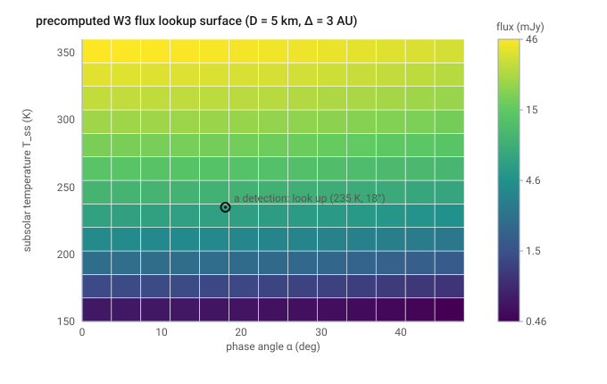

# Step 03 — Thermal flux (NEATM + RSR color correction)

> **Role in the pipeline:** convert each in-view object's physical properties and observing geometry into the color-corrected in-band flux WISE would report, in the system in which the sensitivity limits are quoted.
> **Implementation:** `simmer/thermal.py` (`flux_band_wise_lut`, `flux_band_wise`, `flux_band`, `subsolar_temperature`, `bond_albedo`, `planck_nu`) and `simmer/bandpass.py` (`get_bandpass`, `Bandpass.P`, `color_correction_blackbody`).
> **↩ Back to the [procedure overview](../../README.md).**

## Purpose

For every object that survived the field-of-view association (Step 02), compute the
infrared flux the WISE survey would have measured. The model is the Near-Earth
Asteroid Thermal Model (NEATM; Harris 1998): a spherical body with a subsolar
temperature raised or lowered by the beaming parameter η, integrated over the
sunlit dayside, convolved through the WISE relative system response (RSR) curves,
and returned as the **color-corrected flux WISE would report** under WISE's
F_ν ∝ ν⁻² calibration reference — the system in which the single-frame sensitivity
limits are quoted (Step 04, Detection).

## Inputs & data sources

- Per-object physical properties from the SynthPop catalog: diameter `diam_km`,
  geometric albedo `pV`, and IR beaming parameter `eta`.
- Per-detection observing geometry from the ephemeris/FOV stages: heliocentric
  distance r (AU), geocentric distance Δ, and phase angle α.
- The WISE relative system response curves for W3 and W4 (Wright et al. 2010),
  shipped in `data/RSR-W{3,4}.txt`, loaded by `bandpass.get_bandpass`.
- Fixed model constants (`SimConfig`): emissivity `emissivity = 0.9`, phase slope
  `slope_G = 0.15`, and `use_flux_lut = True` (lookup table on by default).

## Method & equations

**Subsolar temperature.** With Bond albedo A, beaming η, emissivity ε, and the
Stefan–Boltzmann constant σ,

    T_ss = [ (1 - A) * S0 / r_au**2 / (eta * eps * sigma) ] ** 0.25

with Bond albedo `A = pV * q`, phase integral `q = 0.290 + 0.684*G` (Lebofsky et
al. 1986), and solar constant `S0 = 1361.0` W/m².

**Surface temperature distribution.** The dayside temperature at angular distance
γ from the subsolar point is

    T = T_ss * cos(gamma)**0.25

and the nightside (γ > 90°) is non-emitting.

**Surface quadrature.** The in-band flux is the Planck emission integrated over the
visible, illuminated surface, weighted by projected area toward the observer,

    F_nu = eps * (R/Delta)**2 * INT INT B_nu(T) * [cos(psi) cos(phi - alpha)]_+ * cos(psi) dpsi dphi

evaluated on a (ψ, φ) grid of `n_psi = 30` × `n_phi = 60`. The `[ ]_+` clamps the
integrand to the sunlit, observer-facing surface.

**RSR / reported flux.** WISE reports a monochromatic flux at each band's isophotal
wavelength under the reference spectrum F_ν ∝ ν⁻² (f_λ = const). Per-photon signal
through the RSR curve R(λ) is

    S(F) = INT F_nu(lam) R(lam) dlam / lam ,

and matching the source signal to the reference spectrum's signal gives the
reported flux

    F_rep = [ INT F_nu^src R dlam/lam ] / [ INT (lam/lam_iso)^2 R dlam/lam ] ,

where the denominator is the precomputed reference norm `ref_norm`. For the
reference spectrum this reduces to F_ν(λ_iso) (color correction = 1 by
construction). To avoid per-wavelength work at every detection, the
band-integrated Planck-through-RSR quantity

    P(T) = INT B_nu(lam, T) R dlam/lam

is precomputed once per band (`Bandpass.P`), so the surface quadrature integrates
`P(T(ψ, φ))` rather than a full spectrum at every grid cell.
`bandpass.color_correction_blackbody` returns the explicit blackbody color
correction `f_c = F_nu(lam_iso) / F_rep = B_nu(lam_iso, T) * ref_norm / P(T)`.

**Lookup table.** Because the NEATM surface integral depends only on subsolar
temperature and phase angle, the per-photon signal is tabulated once as
`S(T_ss, α)` (`thermal.flux_band_wise_lut`) on a grid of `n_Tss = 140` × `n_alpha
= 61`, wrapped in a `RegularGridInterpolator`. The per-object flux is then a table
lookup scaled by `(R/Δ)² / ref_norm` — ~750× faster than re-integrating the
quadrature per detection, at <0.1–0.2% error.

## Justifications & decisions

- **NEATM over the (refined) Standard Thermal Model.** NEATM (Harris 1998) carries
  a fitted beaming parameter η per object, the model calibrated for WISE/NEOWISE
  minor-planet diameters and albedos (Mainzer et al. 2011; Masiero et al. 2011),
  and is the model in which the input catalog's η values are defined.
- **Report color-corrected flux, not monochromatic.** The WISE sensitivity limits
  are quoted in WISE's reported-flux system (F_ν ∝ ν⁻² reference spectrum; Cutri
  et al. 2012), so the simulated flux must be carried into the same system for the
  detection cut to be meaningful.
- **Lookup table on by default (`use_flux_lut = True`).** The `(T_ss, α)` surface
  is geometry-independent, so tabulating it once removes the thermal stage as a
  runtime cost (~750× faster) at <0.2% error, making it negligible relative to the
  field-of-view cross-match.

## Boundary studies & systematics

- **Lookup-table fidelity.** The tabulated `S(T_ss, α)` reproduces the per-detection
  quadrature to <0.1–0.2% over the grid, well below the photometric and model
  systematics of the survey.
- **Color-correction verification.** `bandpass.color_correction_blackbody` is to be
  checked against the WISE Explanatory Supplement Table 2 blackbody `f_c` values
  (Cutri et al. 2012).

## Figures

*The precomputed `S(T_ss, α)` lookup surface, shown as W3 flux for a 5 km / 3 AU asteroid: flux climbs steeply with subsolar temperature (12 µm sits on the Wien tail) and falls with phase angle as less of the hot dayside faces the observer.*

## References

- Harris, A. W. 1998, Icarus, 131, 291 — NEATM.
- Lebofsky, L. A., et al. 1986, Icarus, 68, 239 — refined Standard Thermal Model.
- Mainzer, A., et al. 2011, ApJ, 736, 100 — WISE/NEOWISE thermal-model calibration for minor planets.
- Mainzer, A., et al. 2011, ApJ, 731, 53 — NEOWISE thermal fits of near-Earth objects.
- Masiero, J. R., et al. 2011, ApJ, 741, 68 — Main-Belt asteroid diameters/albedos from WISE/NEOWISE.
- Wright, E. L., et al. 2010, AJ, 140, 1868 — WISE mission; relative system response (RSR) curves.
- Jarrett, T. H., et al. 2011, ApJ, 735, 112 — WISE absolute photometric calibration and color corrections.
- Cutri, R. M., et al. 2012, *Explanatory Supplement to the WISE All-Sky Data Release Products*, Sec. IV.4.h — reference spectrum (F_ν ∝ ν⁻²), isophotal wavelengths and zero-magnitude flux densities (Table 1), color-correction table (Table 2).
