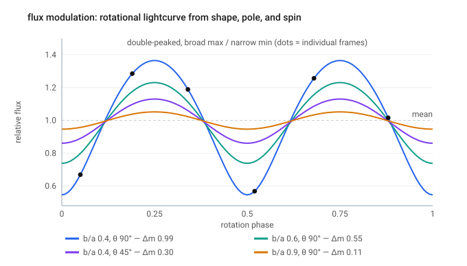
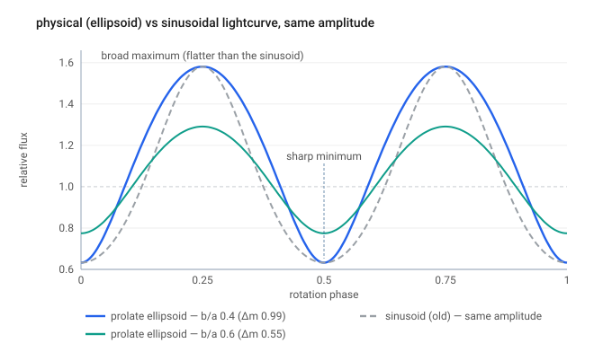
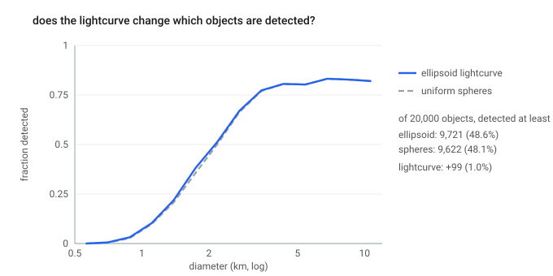

# Step 04 — Rotational lightcurve modulation

> **Role in the pipeline:** modulate each object's thermal flux by the projected-area lightcurve of a rotating prolate ellipsoid, so repeated detections are phase-linked in time and near-threshold objects vary across the sensitivity limit.
> **Implementation:** `simmer/lightcurve.py` (`aspect_angle_deg`, `amplitude_mag`, `assign_rotation`, `rotational_phase`, `projected_area`, `_mean_area`, `modulate_flux`, `pole_unit_vector`).
> **↩ Back to the [procedure overview](../../README.md).**

## Purpose

The NEATM flux (Step 03) is that of a uniform sphere. Real asteroids are elongated
and spinning, so a survey sees a time-varying flux whose amplitude and phase depend
on the body's shape, spin-pole orientation, and rotation period. This step
modulates each object's flux by the **projected-area lightcurve of a rotating
prolate ellipsoid** (Surdej & Surdej 1978) — intrinsically double-peaked, with the
physical broad-maximum / narrow-minimum shape — while preserving the
rotation-averaged (mean) flux. Because each object is given a fixed period and
phase keyed to its identity, its repeated detections across the survey cadence are
**phase-linked in time**, and objects whose mean flux sits near the sensitivity
limit are lifted over it on their bright frames.

## Inputs & data sources

- Per-object shape from the SynthPop catalog: axis ratio `b_over_a` (with a = 1,
  b = c = `b_over_a`).
- Per-object spin pole `pole_beta_deg` / `pole_lambda_deg`, converted to a unit
  vector (`pole_unit_vector`) and combined with the per-detection line of sight to
  give the aspect angle (`aspect_angle_deg`).
- Per-detection observation time and line-of-sight geometry from the ephemeris/FOV
  stages.
- Fixed model constants (`SimConfig`): `apply_lightcurve = True`,
  `rot_period_min_hr = 2.2`, `rot_period_max_hr = 20.0`.

## Method & equations

**Projected area.** For a prolate ellipsoid (a = 1, b = c = `b_over_a`) rotating
about a short axis, viewed at aspect angle ξ, with rotation angle θ = 2π·phase, the
relative projected area is

    A(theta) = sqrt( 1 - k^2 cos^2(theta) ),   k^2 = (1 - b^2) sin^2(xi) .

**Mean-flux normalization.** The flux multiplier is `A(θ) / <A>`, where the
rotation-averaged area is the complete elliptic integral of the second kind E,

    <A> = (2/pi) E(k^2) ,

so the mean flux is preserved (`modulate_flux` = `projected_area` / `_mean_area`).

**Amplitude (Sheppard & Jewitt 2004).** The peak-to-peak amplitude `2.5
log10(A_max/A_min)` reduces *exactly* to

    dm = 2.5 log10(a:b) - 1.25 log10[((a:b)^2 - 1) sin^2(theta) + 1] ,

where S&J's θ is measured from the spin equator. Simmer's `aspect_deg` is the
standard aspect angle (spin pole vs. line of sight, in [0, 90]), the complement of
S&J's θ, so `sin^2(theta) -> cos^2(aspect)`: the amplitude is 0 pole-on
(aspect = 0) and maximal equator-on (aspect = 90).

**Period and phase.** `assign_rotation` draws each object's rotation period
**log-uniform** in [`rot_period_min_hr`, `rot_period_max_hr`] and its initial phase
uniformly. Both are **fixed** per object and keyed by the global object index (via
the deterministic per-object seeding), so a given object presents a coherent,
phase-linked lightcurve across every frame in which it is observed rather than an
independent random flux per detection. `rotational_phase` propagates the phase to
each observation time.

## Justifications & decisions

- **Physical ellipsoid shape, not a sinusoid.** Elongation and pole orientation set
  the amplitude (identical to Sheppard & Jewitt 2004), but the ellipsoid geometry —
  not a sinusoid — sets the *shape*: at equal amplitude the ellipsoid has broad
  maxima and sharp minima. The broad maxima are what push faint objects over the
  limit on their bright frames.
- **Mean flux preserved.** Normalizing by `<A> = (2/π) E(k²)` guarantees the
  rotation-averaged flux is unchanged, so the lightcurve redistributes flux in time
  without biasing the mean.
- **Fixed per-object period + phase.** Phase-linking the detections in time is the
  physically correct behavior; an independent random phase per detection would wash
  out to the same distribution and lose the temporal coherence that matters near the
  threshold.
- **Log-uniform period in [2.2, 20.0] hr.** Spans the bulk of the observed
  main-belt rotation-period range while excluding the sub-2.2 h spin barrier.
- **Switchable (`apply_lightcurve = False`).** Turning the modulation off treats
  objects as uniform spheres, isolating the effect of the lightcurve assumption.

## Boundary studies & systematics

- **Effect on detection completeness.** Comparing the ellipsoid and uniform-sphere
  cases on the same population isolates the lightcurve assumption: it lifts a small
  fraction of extra objects into the detected set (+1%, ~100 of ~9,700 of 20,000),
  *all* in the near-threshold diameter range — broad maxima push faint objects over
  the limit on their bright frames — while the bright and faint ends are unchanged.
  The effect is modest because the photometric noise (Step 05) already scatters
  marginal objects across the threshold.

## Figures

*The projected-area lightcurve of a rotating prolate ellipsoid (Surdej & Surdej 1978), intrinsically double-peaked; repeated detections of one object are phase-linked in time by its rotation period (dots).*

*At equal peak-to-peak amplitude, the ellipsoid geometry gives broad maxima and sharp minima, versus a sinusoid — elongation and pole set the amplitude, the ellipsoid geometry sets the shape.*

*Ellipsoid vs. uniform-sphere detection: the lightcurve lifts ~+1% extra objects into the detected set, all in the near-threshold diameter range, with the bright and faint ends unchanged.*

## References

- Surdej, J., & Surdej, A. 1978, A&A, 66, 31 — lightcurve of a rotating three-axis ellipsoid (the projected-area shape model).
- Sheppard, S. S., & Jewitt, D. C. 2004, AJ, 127, 3023 — the equivalent peak-to-peak amplitude vs. aspect angle.
