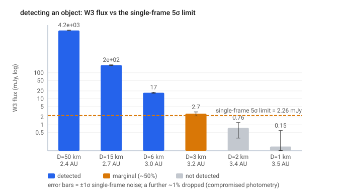
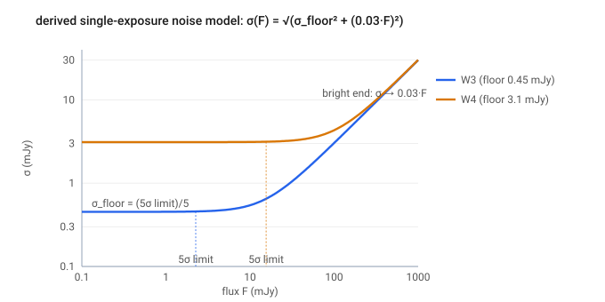
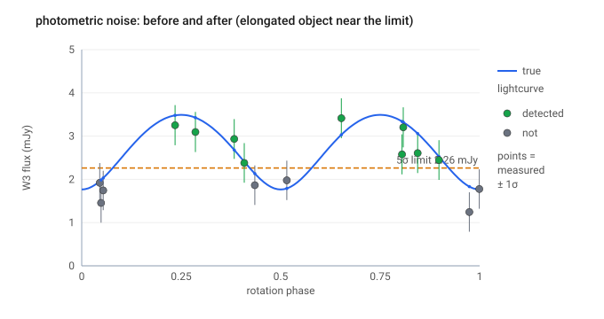
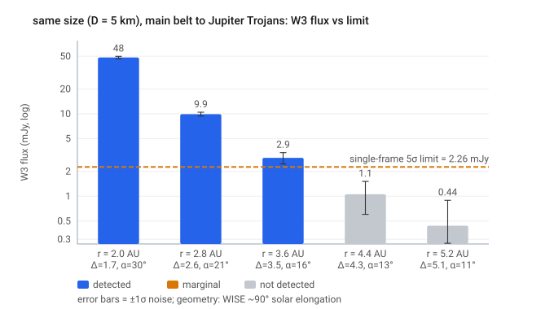

# Step 05 — Detection & tracklet linking

> **Role in the pipeline:** turns each in-view object's noise-scattered per-frame flux into a per-frame detection, then requires those detections to form a WMOPS-style linkable tracklet before the object enters the catalog-eligible ("detected") sample.
> **Implementation:** `simmer/detect.py` (`apply_detection`), `simmer/linking.py`, `simmer/pipeline.py` (`object_summary`).
> **↩ Back to the [procedure overview](../../README.md).**

## Purpose

A single-exposure flux above the sensitivity limit is not, by itself, a catalog detection. Two stages stand between the modeled flux (Steps 02–04) and an object counted in η(D):

1. **Detection** — each in-view frame flux is scattered by photometric noise, tested against the single-frame 5σ limit, and a small fraction is decimated for compromised photometry. This produces a per-(object, frame) `detected` flag.
2. **Tracklet linking** — an object enters the observed sample only if enough of its per-frame detections cluster within one apparition to form a linkable tracklet (the WMOPS criterion), its apparent sky-motion falls in the WMOPS acceptance band, and it survives a flat residual processing efficiency.

This step documents the mechanism and equations of both stages. Their *quantified* systematic impact on η(D) is documented separately — see [Step 06 — detection efficiency](06_efficiency.md) for the full η systematics ledger.

## Inputs & data sources

- **Per-frame flux** `flux_jy` per (object, frame), with `band`, `obj_idx`, `frame_idx`, `id`, `mjd`, `ra_deg`, `dec_deg` — the output of the field-of-view match, NEATM flux, and rotational lightcurve stages.
- **Single-exposure 5σ sensitivities** `sensitivity_jy` per band (`surveys/neowise.py::default_sensitivity_jy`). Asteroids move ~arcminutes between frames, so they are detected in **individual single-exposure (L1b) frames**, never in the deep multi-frame coadds static sources benefit from; the limits are therefore single-frame throughout.
  - **W3 = 0.86e-3·√11 ≈ 2.85 mJy, W4 = 5.4e-3·√11 ≈ 17.9 mJy** — anchored on the measured near-ecliptic coadd depths (W3 0.86 mJy, W4 5.4 mJy; WISE All-Sky Explanatory Supplement §6.3a, quoted for zodiacal levels near the ecliptic and high Galactic latitude) times √(depth-of-coverage N ≈ 11), since moving asteroids do not co-add.
  - **W1 = 44e-6·√8, W2 = 93e-6·√8** — retained on the earlier Wright et al. 2010 8-coadd basis (not used for the W3/W4 thermal fit).
  - The current W3/W4 values are ~1.25× shallower than the earlier Wright-8-coadd back-projection (44/93/800/5500 µJy × √8 → W3 2.26 mJy, W4 15.6 mJy): the ecliptic achieved ~11 coverages (not 8), and the measured coadd fell slightly short of ideal √N scaling. Uncertain at the ~1.2× level (coaddition efficiency).
- **Deterministic RNG seeds** — the photometric-noise draw, bad-pixel draw, and link-keep draw are each keyed by identity (object/frame index, or object id) via `simmer.seeding`, so results are independent of how a run is batched across workers.
- **Config** (`SimConfig`): `snr_threshold=5.0`, `photometric_noise=True`, `photometric_frac_err=0.03`, `bad_pixel_fraction=0.01`; `min_detections=5`, `detection_band="W3"`, `tracklet_window_hr=36.0`, `link_efficiency=0.92`, `min_motion_deg_day=0.06`, `max_motion_deg_day=3.2`.

## Method & equations

### Detection (`simmer/detect.py::apply_detection`)

Each in-view frame flux `F` is compared to the band's 5σ single-frame limit `sens`. With photometric noise on (default), the measured flux is the true flux plus Gaussian noise whose width has a background/read-noise floor and a bright-end fractional-error term:

    sigma(F) = sqrt(sigma_floor^2 + (frac_err*F)^2),   sigma_floor = (5-sigma limit) / 5

The noise draw is a deterministic uniform `u ∈ (0, 1)` (clipped to `[1e-9, 1 − 1e-9]`) mapped through the Gaussian inverse-CDF `ndtri`:

    flux_meas = flux + ndtri(u) * sigma

and the per-frame detection test is

    above = flux_meas >= snr_threshold * sigma

This turns the hard threshold into a smooth error-function completeness curve: a source exactly at the limit is detected ~50% of the time. That smoothing is what makes η(D) roll over smoothly rather than as a step.

When `photometric_noise=False`, the fallback is a hard cut with no scatter:

    flux_meas = flux
    above = flux >= sens * (snr_threshold / 5.0)

**Bad-pixel / compromised-photometry decimation.** A separate, flat fraction of above-threshold detections is dropped to approximate photometry lost to bad pixels, cosmic rays, or blending. With a deterministic per-detection draw `u`:

    keep = above & (u >= bad_pixel_fraction)

`bad_pixel_fraction = 0.01` gives a uniform, position-independent ~1% loss. The per-frame result is `flux_meas_jy`, `above_threshold`, and `detected` (= `keep`).

### Tracklet linking (`simmer/pipeline.py::object_summary` + `simmer/linking.py`)

A per-frame `detected` flag is necessary but not sufficient. `object_summary` collapses the per-frame detections into a per-object verdict. An object is **`detected`** (enters the observed sample) iff **all** of the following hold:

1. **Tracklet window** — `tracklet_len >= min_detections` within one apparition. `tracklet_len` is the most detections landing within any window of `tracklet_window_hr` hours, computed by a two-pointer max-in-window scan over the sorted detection times (`linking.max_in_window`, `linking.tracklet_sizes`); the window is closed on both ends. Only detections in `detection_band` ("W3") are counted. When `tracklet_window_hr=None`, `tracklet_len` falls back to the looser survey-wide `n_detections`.
2. **Apparent-motion gate** — the object's apparent sky-motion rate lies in `[min_motion_deg_day, max_motion_deg_day]` = `[0.06, 3.2]` deg/day. The rate (`linking.apparent_rates`) is the **median** of adjacent-pair great-circle rates (haversine separation ÷ Δt) over detection pairs separated by less than one apparition, so it is the true instantaneous rate and not aliased by motion across a months-long gap. A NaN rate (no close pair) does **not** reject — those objects fail on `tracklet_len` anyway.
3. **Flat link-keep** — the object survives a flat per-object `link_efficiency = 0.92` draw (`linking.link_keep`): a deterministic uniform keyed by object identity, kept if `u < link_efficiency`. This is a uniform multiplier — it lowers normalization but does not change the shape of η(D).

Because each individual detection must clear the per-frame S/N cut, the number that land within one window falls steeply as an object fades — so the **tracklet-window requirement, not the per-frame limit alone, sets the small-size η roll-off, and the magnitude dependence is emergent** rather than a separately tuned curve.

*Scope of the flat 0.92 factor (brief note):* it models **only** the residual WMOPS automated-processing loss (linker association, track-validation/quality cuts, de-duplication, region masking), *conditional* on a valid tracklet already existing. It deliberately does **not** re-apply flux/extraction losses (handled upstream in `detect.py`) or tracklet-formation loss (ingredient 1); folding either in would double-count. The "should we double-count" reasoning is developed in [Step 06](06_efficiency.md).

## Boundary studies & systematics

### Detection-criterion provenance (audited 2026-08-25)

The real chain that populates N_obs (the PDS diameter catalog) is: WMOPS blind
extraction at **S/N ≈ 4.5** per Level-1b detection, ≥5 detections, 0.06–3.2 deg/day
(Expl. Suppl. §4.5) → MPC association to a known orbit → **successful NEATM fit**
(the actual gate for catalog entry, stricter than a raw tracklet). Simmer models the
detect+link factor at **snr_threshold = 5.0** with photometric-noise scatter.
Provenance of the difference, and why it is controlled:

- **PyLEADER `.obs` files impose no 4.5σ cut** (audited in `pyleader/obsfiles/build.py`):
  their per-detection gate is cc_flags ∈ {0,p,P}, **ph_qual ∈ {A,B,C}** (≈ SNR ≥ 2),
  redder-band flag 0, ≥5 rows/object. The .obs files feed only the shape/pole
  (lightcurve) inputs — the pathway bounded at ~1% effect on η — not N_obs.
- **Threshold sensitivity, measured** (Sulamitis 50-member ensemble rerun at 4.5σ):
  η identical on the plateau (Δη = 0.000 for D ≳ 2.5 km); in the roll-off, η(4.5σ)
  exceeds η(5.0σ) by up to +0.075 (D ≈ 1.7 km), tapering to 0 by 2.5 km. **29/30
  bins lie inside the production run's systematic band** — the ±15% ScienceFloor
  sensitivity term brackets the choice by construction. Family FITS (gated above
  D_complete ≥ 1.68 km, mostly ≥ 2.7 km) are in the Δη = 0 regime.
- **Effective-calibration anchor:** the end-to-end η-vs-a validation (model vs
  N_obs/N_known, +0.02 median) empirically supports the 5.0σ-equivalent effective
  depth for catalog entry — consistent with the NEATM-fit acceptance sitting above
  the raw 4.5σ tracklet threshold.
- **Chain decomposition (going forward):** η_chain = η_blind (modeled here) ×
  P_fit (fit-acceptance emulation — planned Simmer upgrade; verify Masiero 2011's
  criteria first) × P_known (measured empirically by the blind census's
  discovery-completeness map, `blind_census_design.md`). Above D_complete the last
  two factors ≈ 1, which is why the current fits are valid as published.

The full, quantified η systematics ledger — per-frame sensitivity, photometric-noise smoothing, bad-pixel decimation, the tracklet requirement, the flat linking efficiency, and the double-count reasoning — lives in [Step 06 — detection efficiency](06_efficiency.md). One boundary study directly constrains this step's key free parameter, the tracklet window width.

**Tracklet window-width sensitivity** (Flora family, η at 1.1 km):

| window | 3 h | 6 h | 12 h | 24 h | 36 h | survey-wide |
|--------|-----|-----|------|------|------|-------------|
| η@1.1 km | 0.00 | 0.05 | 0.14 | 0.17 | 0.18 | 0.19 |

At a physically defensible window (≥ one ~day-long apparition) the requirement collapses to the survey-wide ≥5 count and barely changes η — Flora's detections are already clustered in one apparition. Only an aggressively tight window (≤6 h) produces strong small-D suppression, and that width is **not** constrained by published information, so it must **not** be tuned to the desired answer. The default is kept conservative (36 h).

The apparent-motion gate has **≈ 0 effect on main-belt families** (MBA rates ~0.2–0.3 deg/day sit well inside the 0.06–3.2 deg/day band); it is included as a physically correct, published safeguard that also generalizes to fast (NEO) and slow (distant) populations.

## Figures

*Summary — the detection cut: flux vs the single-frame 5σ limit, with the noise band deciding marginal cases.*

*The noise model σ(F): flat at σ_floor = (5σ limit)/5, rising as frac_err·F toward bright fluxes.*

*Noise scatters several near-limit frames across the threshold on a single object's lightcurve.*

*Equal 5 km bodies fade by >2 orders of magnitude out to the Trojans, dropping below the limit.*

## References

- Wright, E. L., et al. 2010, AJ, 140, 1868, §3 — WISE mission; 8-frame 5σ sensitivities (44/93/800/5500 µJy in W1–W4); relative system response. The earlier single-exposure limits are those × √8 (per-frame detection).
- Cutri, R. M., et al., *Explanatory Supplement to the WISE All-Sky Data Release Products* — §6.3a & §2.2 (measured near-ecliptic coadd depths W3 = 0.86 mJy, W4 = 5.4 mJy; observing basis); §4.5 (WMOPS: a tracklet required a minimum of 5 detections from different scans above S/N ~4.5, with 90% automated-processing completeness — 92% in pipeline V3.5 — for objects that met the original criteria; apparent-motion sensitivity 0.06–3.2 deg/day).
- Mainzer, A., et al. 2011, ApJ, 736, 100; ApJ, 731, 53; ApJ, 743, 156 — WISE/NEOWISE thermal-model calibration and NEOWISE detection performance.

*The `min_detections = 5` tracklet requirement matches the upstream PyLEADER `ObsBuildConfig.min_obs = 5`.*

### P_fit verification (2026-08-27, closes the chain's middle factor)

Masiero et al. (2011) Section 2 (local copy, verified): thermal-modeling
acceptance required (1) >= 3 detections in one WISE band with sigma_mag <=
0.25 (i.e., SNR >= 4.3), (2) for multi-band fits, other bands at >= 40% of the
best band's detection rate, (3) positions cross-checked against the
Daily/Atlas coadds within 6.5" to reject inertially fixed sources, (4)
saturation limits W3 > -2 (irrelevant at family sizes). Beaming fit only with
>= 2 thermal bands (eta peak 1.0, sigma 0.2).

The Simmer-modeled chain already imposes STRICTER conditions than (1): the
>= N-detections linking requirement (ledger #4) at the modeled 5.0-sigma
sensitivity (bracketed +/-15%), and PyLEADER's min_obs = 5. Condition (3) is
the static-source confusion effect (ledger #7, minor). Therefore **P_fit ~ 1
conditional on the already-modeled detection criteria** — the eta_chain =
eta_blind x P_fit x P_known decomposition needs no additional emulated gate;
the fit-acceptance stage does not remove objects the detection stage kept.
