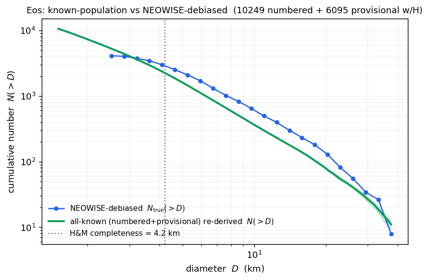
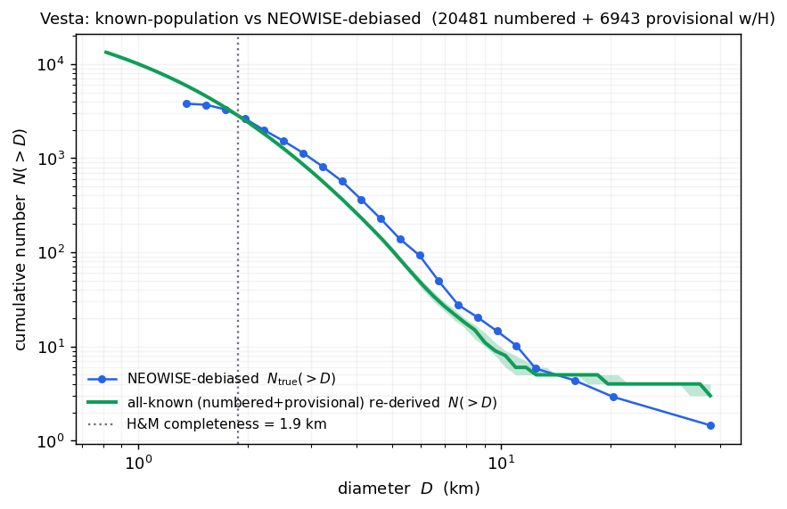

# Step 07 — Debiasing (observed SFD → N_true)

> **Role in the pipeline:** assembles the *real* observed size-frequency distribution N_obs(D) from the NEOWISE diameter catalog (via canonical designation matching to the family list) and inverts the survey selection, N_true(D) = N_obs(D) / η(D), with propagated uncertainties.
> **Implementation:** `simmer/observed.py`, `simmer/designations.py` (`canonical`), `simmer/debias.py` (`debias`); driver `scripts/debias_families.py`.
> **↩ Back to the [procedure overview](../../README.md).**

## Purpose

The efficiency function η(D) from Step 06 encodes how the cryo survey undercounts objects as a function of size. This step applies it to the *real* data. It has two halves that meet at a division:

1. **Assemble N_obs(D)** — the count of real NEOWISE-detected family members per diameter bin, built by cross-matching a family's member list (AFP proper-element file) to the NEOWISE diameter catalog and histogramming the matched diameters onto the efficiency bin grid.
2. **Debias** — invert the survey's selection bin by bin,

       N_true(D) = N_obs(D) / eta(D),

   propagating the Poisson uncertainty on N_obs and the Wilson uncertainty on η into an asymmetric band on N_true, and flagging bins where η is too small to invert reliably.

Dividing by η corrects for NEOWISE's *detection* selection, but **not** for incompleteness in the family *membership identification* itself (the AFP list is drawn from a proper-element catalog biased toward larger, numbered, multi-opposition objects). So the debiased SFD is corrected for the survey, not for how the family was defined — reliable above the membership completeness limit, increasingly uncertain below it.

The broken-power-law fit of the debiased SFD is a separate step — see [Step 08 — SFD fit](08_sfd_fit.md).

## Inputs & data sources

- **Efficiency table** `eff` — the per-bin η(D) from a Simmer run (or ensemble), with columns `d_lo`, `d_hi`, `d_mid`, `eta`, `eta_lo`, `eta_hi` (the 1σ Wilson interval; Step 06). Its rows must be contiguous in diameter.
- **Family membership** (AFP proper-element list) — the numbered and provisional designations assigned to each family (`observed.family_member_ids`, one id column). The ~34–43% of members that are provisional (small, recently-discovered objects) are kept.
- **NEOWISE diameter catalog** (`neowise_mainbelt.csv`) — thermal-model diameters and albedos per object, a multi-source compilation (Masiero et al. 2011 cryo + reactivation 2013–2017 works). Columns used by `observed.observed_sfd`: number/designation (`neo_number_col=2`), diameter (`neo_d_col=11`), fit-epoch JD (`neo_epoch_col=5`).
- **Cryo-phase window** `CRYO_JD = (2455203.5, 2455415.5)` — the fully-cryogenic 4-band phase (2010-01-07 – 2010-08-06), used to restrict N_obs to the same survey the simulation replays.
- **Config** (`debias`): `eta_min = 0.05` (reliability floor), `z = 1.0` (1σ intervals).
- **Driver** `scripts/debias_families.py` reads the saved efficiency ensemble only (no Simmer runs), so it is fast and re-runnable.

## Method & equations

### Designation matching (`simmer/designations.py::canonical`)

An asteroid can be written several ways: a permanent NUMBER, plain (`5`) or, for numbers ≥ 100000, in MPC PACKED form with a leading letter (`A0001` = 100001; `z9999` = 619999; `~AZaz` base-62 for ≥ 620000); or a PROVISIONAL designation, human-readable (`2013 PL32`, `2013PL32`) or MPC PACKED (`K13P32L` = 2013 PL32). The AFP family lists use plain numbers + human provisional designations; the NEOWISE catalog uses MPC packed forms. `canonical()` reduces any form to one key — an `int` for a numbered object, or a normalized provisional string `"<year><half-month><letter><cycle>"` (e.g. `"2013PL32"`, cycle omitted when zero) — or `None` if unparseable. The join matches on that key, so members join to the catalog regardless of how either side writes the designation. A named asteroid is always also numbered and appears by its number, so no name handling is required.

### N_obs(D) (`simmer/observed.py::observed_sfd`)

`observed_sfd` returns `(n_obs, diam_obs, n_matched)`: the per-bin count array aligned to `bins`, the matched diameters, and the number of unique family members that had a NEOWISE diameter. A NEOWISE row is kept when its canonical id is a family member, its diameter is finite and > 0, and (when `cryo_jd` is set) its fit-epoch falls in the cryo window:

    keep = cid.notna() & d.notna() & (d > 0) & cid.isin(members)
    keep &= (ep >= cryo_jd[0]) & (ep <= cryo_jd[1])

The catalog carries several thermal-fit rows per object (separate per-band/per-apparition fits), so the kept rows are collapsed to **one diameter per unique object** by taking the per-object median before histogramming (within-object diameter spread is ~0, so the median is safe):

    diam_obs = DataFrame({"num": cid[keep], "D": d[keep]}).groupby("num")["D"].median()
    n_obs, _ = histogram(diam_obs, bins)

`bin_observed(diam_obs, eff)` is the convenience form that histograms observed diameters directly onto the efficiency table's edges, `edges = [d_lo…, d_hi[-1]]`; it raises if the efficiency bins are not contiguous (empty simulation bins were dropped), in which case the caller must bin on matched edges and pass counts to `debias` directly.

### Debiasing (`simmer/debias.py::debias`)

The central estimate is the exact inversion, evaluated where η > 0:

    N_true = N_obs / eta

Two independent uncertainties propagate into N_true:

**Count term — Poisson.** For a bin containing `k` detections the count uncertainty is the asymmetric Poisson confidence interval, via the Wilson–Hilferty cube-root approximation to the chi-square (Poisson) limits (`poisson_interval`, Gehrels 1986). At `z` sigma the upper and lower limits are

    hi = (k + 1) * (1 - 1/(9*(k+1)) + z/(3*sqrt(k+1)))**3
    lo =  k      * (1 - 1/(9*k)     - z/(3*sqrt(k)))**3        (lo = 0 for k = 0)

For `k = 0` the lower limit is 0 and the upper ≈ 1.84 at 1σ. The Poisson spread is carried through the 1/η factor:

    d_obs_hi = (nobs_hi - n_obs) / eta
    d_obs_lo = (n_obs - nobs_lo) / eta

**Efficiency term — exact at the Wilson endpoints.** Because N_true = N_obs/η is exact (nonlinear) in η, the efficiency term is propagated by evaluating the inversion at the Wilson endpoints `[eta_lo, eta_hi]` rather than linearising:

    d_eta_hi = n_obs * (1/eta_lo - 1/eta)     # -> inf if eta_lo = 0
    d_eta_lo = n_obs * (1/eta - 1/eta_hi)

**Combination.** The two one-sided deviations are added in quadrature per side:

    n_true_hi = n_true + sqrt(d_obs_hi**2 + d_eta_hi**2)
    n_true_lo = n_true - sqrt(d_obs_lo**2 + d_eta_lo**2)

with `n_true_lo` clipped at 0.

**Reliability flag.** Where η is small the correction 1/η blows up and becomes unreliable, so bins with `eta < eta_min` (or `eta_lo = 0`) are flagged

    reliable = (eta >= eta_min) & (eta_lo > 0)

and their upper bound is left unbounded rather than quietly reported.

## Justifications & decisions

**Designation parsing — numbered + provisional.** *Decision (updated 2026-07-23, commit c4a728d): use every object with a NEOWISE diameter, matched by canonical designation.* The NEOWISE diameter sample is one of the least-biased asteroid surveys, so the sample uses all of it. Named designations always imply a number and appear by number, so no name handling is needed. AFP family files are **34–43% provisional (unnumbered) designations** (Baptistina 34%, Erigone 43%, Adeona 43%, Astrid 40%, Alauda 42%, Emma 35%); unnumbered objects are disproportionately small and recently discovered.

**The ×2.4 recovery.** An earlier integer-only match silently dropped **~52% of the NEOWISE catalog** — 79,327 numbered objects ≥ 100000 (MPC-packed with a letter prefix) and 14,414 provisional objects, both skewed small — which inflated the small-D deficit. Recovering them raised total N_obs **14,422 → 34,498 (×2.4)**, dropped completeness limits ~3 → 2 km, and extended the physical (positive-slope) SFD down to ~1.5 km. The NEOWISE-derived sample still runs out at the smallest (~1 km) sizes, where the optical/MPC extension takes over.

**Cryo-window restriction.** The NEOWISE diameter catalog is a multi-year compilation (cryo 2010 + reactivation 2013–2017), so N_obs is restricted to the cryo phase (`CRYO_JD = (2455203.5, 2455415.5)`, 2010-01-07 – 2010-08-06) by fit-epoch to be consistent with Simmer's cryo-only survey simulation — otherwise multi-year counts would be divided by cryo efficiency. The 4-band restriction is *mandatory*, not optional: the NEOWISE diameters come from a two-band (W3+W4) NEATM fit whose flux calibration applies a W3−W4 color correction selected by the measured W3−W4 color (Wright et al. 2010, Table 1). The 3-band cryo phase (W1–W3, no W4) yields no W3−W4 color and hence no color-corrected diameter, so it cannot extend N_obs.

**Row-multiplicity collapse.** The catalog has several thermal-fit rows per object, with a size-correlated multiplicity: the row count rises with diameter. Histogramming rows would inflate the large-D bins relative to the small-D bins and tilt the SFD slope toward zero/negative, so the rows are collapsed to one median diameter per unique object before histogramming. This corrects survey selection, not family-membership identification incompleteness.

## Figures

*N_true = N_obs / η recovering an input D⁻²·⁵ power law; median recovered/true ≈ 1.0.*

*Known-catalog vs NEOWISE-measured counts, Eos family.*

*Known-catalog vs NEOWISE-measured counts, Vesta family.*

## Output

`scripts/debias_families.py` writes, per family:

- `<name>_debiased_sfd.csv` — one row per bin: `d_lo`, `d_hi`, `d_mid`, `n_obs`, `n_obs_lo`, `n_obs_hi`, `eta`, `eta_lo`, `eta_hi`, `n_true`, `n_true_lo`, `n_true_hi`, `reliable`. The ensemble form additionally carries the separated statistical and total bands as `n_true_stat_lo/hi` and `n_true_tot_lo/hi`.
- `<name>_sfd.png` — the debiased SFD figure.

## References

- Wilson, E. B. 1927, J. Am. Stat. Assoc., 22, 209 — the score confidence interval for a binomial proportion (the η error bar; Step 06).
- Gehrels, N. 1986, ApJ, 303, 336 — confidence limits for small-number (Poisson) counting statistics (the observed-count error bar; `poisson_interval`).
- Hendler, N. P., & Malhotra, R. 2020, PSJ, 1, 75 (arXiv:2010.07822) — size/subpopulation-dependent completeness of the known catalog.
- Masiero, J. R., et al. 2011, ApJ, 741, 68 — Main-Belt asteroid diameters/albedos from WISE/NEOWISE (the `neowise_mainbelt.csv` cryo compilation).
- Wright, E. L., et al. 2010, AJ, 140, 1868, Table 1 — WISE color corrections (the W3−W4 correction underlying the 4-band diameter, hence the cryo-window restriction).
- MPC, "Packed Provisional and Permanent Designations" (minorplanetcenter.net/iau/info/PackedDes.html) — the packed forms `canonical()` parses.
