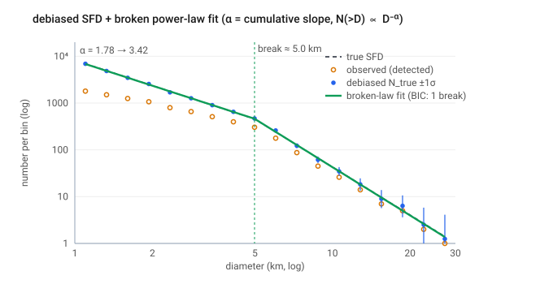

# Step 08 — SFD fit: slopes & breaks

> **Role in the pipeline:** fit a (broken) power law to the NEOWISE-debiased size-frequency distribution above the completeness floor, reporting the cumulative slope α of N(>D) ∝ D⁻ᵅ per segment and the break diameter(s).
> **Implementation:** `simmer/sfd_fit.py` (`fit_sfd`, `fit_sfd_mc`, `_design`, `_fit_fixed`, `_bic`, `predict_density`), plot `simmer/plotting.py` (`plot_sfd`).
> **↩ Back to the [procedure overview](../../README.md).**

## Purpose

The physical payoff of a debiased SFD is its shape: the power-law slope(s) and the location of any break(s). Slopes encode the collisional state (Dohnanyi equilibrium is a cumulative slope α ≈ 2.5); breaks and post-impact "waves" encode material strength, the strength→gravity transition, and post-impact evolution. This step fits that shape from the debiased counts N_true(D) = N_obs(D)/η(D) produced by the debiasing step, and attaches confidence intervals that carry both the statistical and systematic η bands.

**Scope caveat.** Each run characterises *one collisional family* over a narrow size range (≈ 1–25 km), not the whole Main Belt — so a family's slope and break reflect that family's formation and evolution, and are only *contextually* comparable to whole-belt studies (e.g. Vávra & Brož 2026), not a one-to-one match to belt-wide features.

## Inputs & data sources

- **Debiased SFD** — the per-diameter-bin debiased counts and their uncertainty band. `fit_sfd` takes bin edges `d_lo`/`d_hi`, the count `n` per bin, and an optional band `n_lo`/`n_hi`. `fit_sfd_mc` reads a saved `*_efficiency_ensemble.csv` (columns `d_lo`, `d_hi`, `eta`, and the total band `eta_tot_lo`/`eta_tot_hi`) plus the real observed counts per bin, `n_observed`.
- **Reliability mask** — bins with η below the floor `eta_min` (default 0.05) are excluded, since the 1/η correction is unreliable there.
- **Completeness floor** — `d_min` restricts the *fit* to bins with centre ≥ `d_min` (the Hendler & Malhotra completeness floor from Step 07); the debiased SFD is still produced for all bins.

## Method & equations

**Fit space (differential per-dex).** The fit is performed on the per-dex differential density q(D) = dN/dlog₁₀(D), i.e. the counts in each bin divided by the bin's log₁₀ width, as a straight (or piecewise-linear) line in log₁₀ q vs log₁₀ D. With

    u = log₁₀(d_mid),   d_mid = √(d_lo · d_hi),
    q = n / (log₁₀ d_hi − log₁₀ d_lo),   y = log₁₀ q.

**Slope convention.** The fitted log-log slope `s` maps to the **cumulative** slope α of N(>D) ∝ D⁻ᵅ as

    alpha = −s          (for equal-log bins, q ∝ D⁻ᵅ).

The differential slope of dN/dD is α + 1. Every result reports the cumulative α per segment. The convention string returned by `fit_sfd` is `"alpha = cumulative slope of N(>D) ~ D**-alpha"`.

**Hinge model & closed-form fit.** For a fixed set of break positions the model is *linear* in its coefficients (a continuous piecewise-linear "hinge" basis), so each candidate is a single closed-form weighted least-squares. `_design(u, breaks)` builds the design matrix with columns `[1, u, max(0, u−b₁), max(0, u−b₂), …]`. `_fit_fixed` solves the weighted LSQ with weights w = 1/σ_y (`np.linalg.lstsq` on the whitened `X·w`, `y·w`), and returns χ² = Σ[(X·β − y)/σ_y]², the covariance, and the per-segment log-log slopes formed as s₀ = β[1] and each subsequent segment adding the cumulative sum of the hinge coefficients:

    slopes = β[1] + concatenate([[0], cumsum(β[2:])]).

The intercept β[0] is stored as `log10_A` so the fit can be drawn.

**Per-bin uncertainty.** `_sigma_y` gives the 1σ on log₁₀(count): where a band is supplied, σ_y = (n_hi − n_lo)/(2·n·ln10); otherwise the Poisson form σ_y = 1/(√n · ln10) (LN10 = ln 10).

**Number of breaks (model selection by BIC).** `fit_sfd` fits 0, 1, … up to `max_breaks` breaks (default 2) and returns the model with the lowest BIC,

    BIC = chi2 + n_par · ln(n_pts),          (`_bic`)

with n_par = 2 + (number of breaks). A break is therefore reported only when the data justify the extra parameters. Candidate break positions are the interior bin centres, gridded exhaustively via `itertools.combinations`, with each segment constrained to hold at least `min_bins_per_segment` bins (default 3). `force_breaks=k` fits exactly k breaks, skipping model selection — used to refit every ensemble member with the *same* structure as the central model. `fit_sfd` returns `{"best": …, "candidates": […], "n_bins", "convention"}`, where every candidate carries its α per segment, `alpha_err`, `break_diam_km`, `log10_A`, `chi2`, `dof`, `chi2_dof`, `bic`, and `n_par`.

**Monte-Carlo confidence intervals.** `fit_sfd_mc` fits the central model (its number of breaks k) from the central η, then runs `n_draws` (default 500) Monte-Carlo realizations that **combine both independent error sources**:

- η is resampled from its **total** band: η_d = clip(η + N(0, σ_tot), 1e-3, 1), with σ_tot = (eta_tot_hi − eta_tot_lo)/2;
- N_obs is resampled by Poisson: nobs_d = Poisson(N_obs).

Each realization is refit with `force_breaks=k` (the central structure), and the reported CIs are the **16/84th percentiles** of the per-member cumulative slopes and break diameters (`alpha_median`/`alpha_lo`/`alpha_hi`, and `break_diam_median`/`break_diam_lo`/`break_diam_hi` when k > 0).

**Drawing the fit.** `predict_density(best, d)` evaluates the fitted per-dex density dN/dlog₁₀(D) at diameters `d`: it converts each α back to a log-log slope (−α), builds y = log10_A + s₀·u + Σ (s_next − s_prev)·max(0, u − b_u), and returns 10ʸ. Multiplying by a bin's log₁₀ width gives its predicted count.

**Plotting.** `simmer/plotting.py::plot_sfd` renders the debiased SFD as the **cumulative** N(>D) — the reliable per-bin counts summed from large D downward (suffix sum), the published convention that directly exposes the fitted cumulative slope — with the total error band added in quadrature across bins, the observed N_obs(>D) overplotted, and the broken-law fit and break marker drawn on top. The fit floor `d_min` and the H&M completeness reference `D_complete` are read from the fit dict.

**Config defaults:** `max_breaks=2`, `min_bins_per_segment=3`, `n_draws=500`, `eta_min=0.05`. **Output:** the fit is written to disk as `<name>_sfd_fit.json` (slopes, break diameters, CIs, and the full BIC selection trail alongside `<name>_efficiency_ensemble.csv` and `<name>_debiased_sfd.csv`).

## Figures

*Summary — a debiased SFD whose truth is a broken law (α = 1.8 below 5 km, 3.4 above): the fit recovers α = 1.78 → 3.42 and a break at 5.0 km, with BIC selecting one break over zero or two; the green line and break marker are the fitted model, the black dashed line is the truth.*

## References

- Dohnanyi, J. S. 1969, J. Geophys. Res., 74, 2531 — collisional cascade in equilibrium (cumulative slope α ≈ 2.5).
- Vávra, P., & Brož, M. 2026 — whole-belt SFD slopes/breaks (contextual comparison for family fits).
- Bottke, W. F., et al. 2005, Icarus, 175, 111 — collisional and dynamical evolution shaping the small-D SFD.
- Wilson, E. B. 1927, J. Am. Stat. Assoc., 22, 209 — the Wilson score interval carried on η into the MC band.
- Gehrels, N. 1986, ApJ, 303, 336 — small-number Poisson confidence limits on the observed counts.
