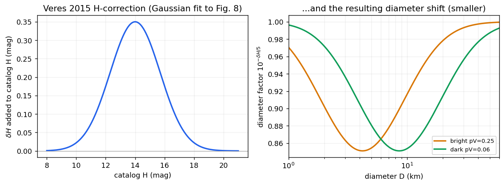
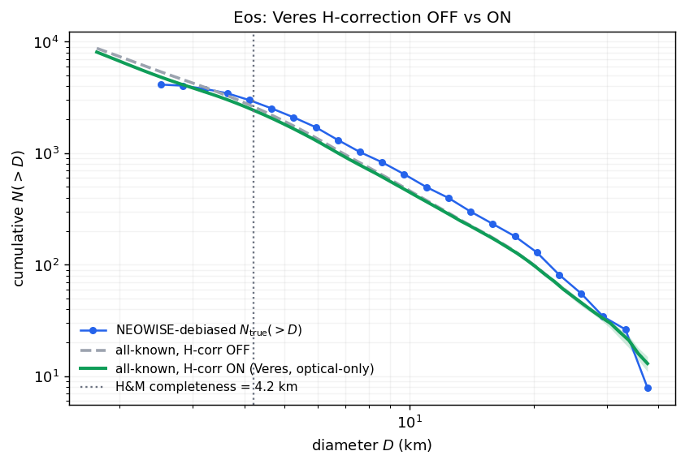
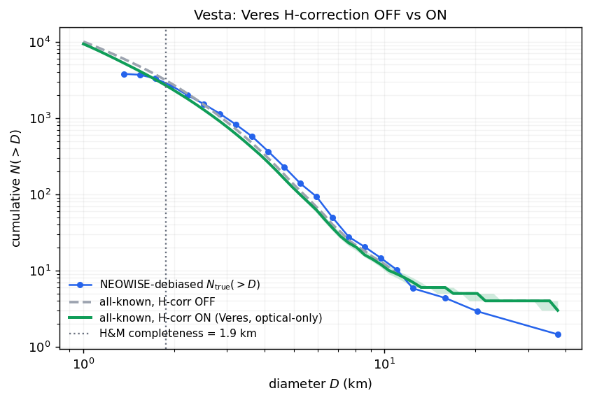
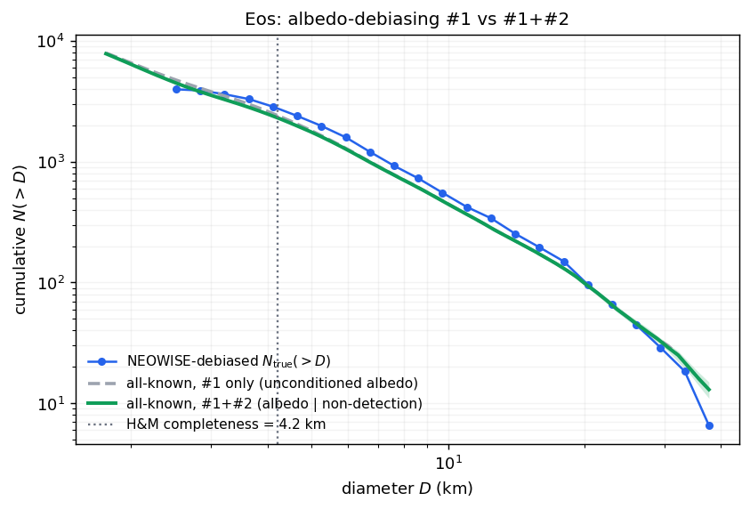
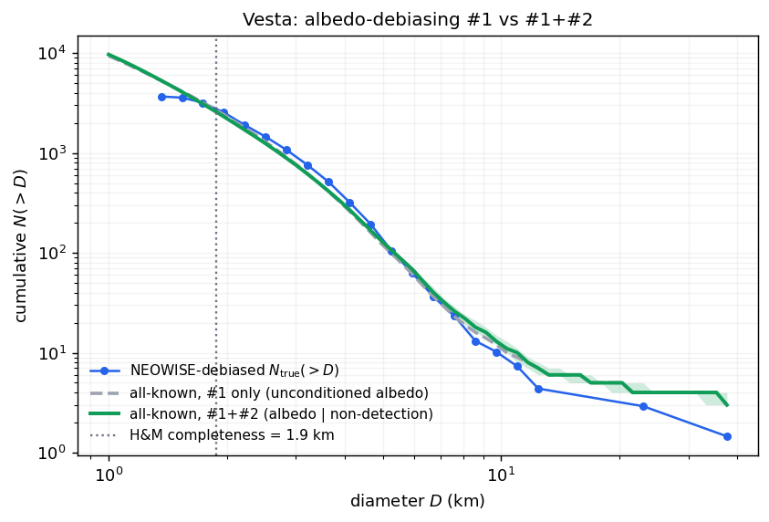
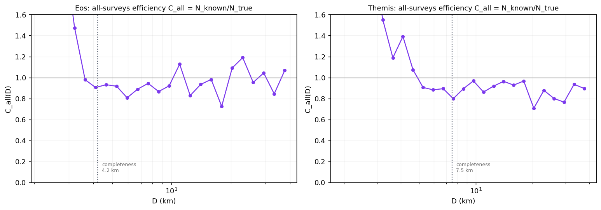

# Step 09 — Small-size extension: completeness + all surveys

> **Role in the pipeline:** push the NEOWISE-debiased SFD below each subpopulation's completeness limit down to ~1 km using the optically-discovered known population, via a measured-and-extrapolated catalog completeness C(D).
> **Implementation:** `simmer/completeness.py` (`observed_completeness`, `hm_peak`), `simmer/optical.py` (`diameter_km`, `known_diameters`, `AlbedoModel`, `sample_conditional_albedo`, `h_correction`, `cumulative_known`, `load_proper_catalog`), `simmer/allsurvey.py` (`extend_sfd`, `hm_rollover_completeness`, `fit_logistic_completeness`, `measured_completeness`, `hm_h_limit`, `jedicke_bright_fraction`), driver `scripts/allsurvey_batch.py`.
> **↩ Back to the [procedure overview](../../README.md).**

## Purpose

The NEOWISE debiasing (Steps 06–08) is complete and reliable only *above* each subpopulation's completeness limit D_complete. Below it the NEOWISE sample runs out, but the *optically discovered* known population continues to smaller sizes. This step bridges the two through the **catalog completeness**

    C(D) = N_known(>D) / N_true(>D),

measured in the overlap above D_complete (there N_true is the NEOWISE debiased count) and extrapolated below it, so the known counts can be corrected down to ~1 km:

    N_true(>D) = N_known(>D) / C(D),      D < D_complete.

The extension is data-driven: no power-law slope is imposed on the sub-completeness SFD, because the small main-belt SFD is not a single power law (a bump near D ~ 3–4 km; Terai & Yoshida 2021). The known count is a **hard lower bound** on N_true (known ⊆ true), which both validates the correction in the overlap and floors the extension.

## Inputs & data sources

- **Family membership** — the AFP proper-element family list.
- **Known-population diameters (per member).** A member's diameter is its NEOWISE **thermal diameter** where it has one (the Masiero et al. 2011 cryo compilation, `neowise_mainbelt.csv`); otherwise it is re-derived from the member's absolute magnitude H in the **AstDyS proper-element catalog** `proper_catalog24.dat`, loaded by `optical.load_proper_catalog` (whitespace-delimited, 12 columns: proper a/e/sin i at 0/2/4, H at 8, designation at 11; holds H for both numbered ~623k and provisional/multi-opposition ~626k objects, keyed by canonical id).
- **Albedos** — measured NEOWISE albedo where available (`optical.neowise_albedos`), else assigned per subpopulation from `AlbedoModel` (see below).
- **η(D)** — the detection efficiency table, used both to condition the optical-only albedo assignment (via `optical.eta_from_efficiency`) and as the debiased N_true in the overlap.
- **Completeness limit D_complete** — from Step 07 (`completeness.observed_completeness` / `hm_peak`).

## Method & equations

**H → diameter.** Catalog H is converted with `optical.diameter_km` (H_TO_D_KM = 1329):

    D [km] = 1329 / √pV · 10^(−H/5).

**Completeness limit (Hendler & Malhotra 2020).** `hm_peak` returns the center of the fullest bin — the peak of the differential distribution — with σ = bin_width / √n_peak. `observed_completeness` applies it to a family's NEOWISE-observed members: H in 0.25-mag bins (`h_bin=0.25`) for `H_complete`, and log-D in 0.05-dex bins (`d_dex=0.05`, = 0.25 mag) for `D_complete`, the SFD-fit floor. The optical-catalog H limit for the extension is a separate quantity: `allsurvey.hm_h_limit` returns the center of the fullest 0.5-mag bin of the *known* members' H distribution (the depth to which the all-surveys catalog is complete — fainter than the NEOWISE thermal completeness).

**Measured overlap completeness.** `measured_completeness` evaluates C(D) = N_known(>D)/N_true(>D) on the diameter grid only where D ≥ D_complete and N_true > 0, clipped to (0, 1] (statistical noise can push the raw ratio slightly above 1).

**Extrapolation below completeness — two forms.** `extend_sfd` extrapolates C(D) two ways and reports their spread as a systematic band:

1. **H&M rollover folded with the albedo distribution** (`hm_rollover_completeness`, `jedicke=True` default). An object of true diameter D and albedo pV is in the optical catalog iff H ≤ H_lim ⇔ D ≥ `diameter_km(H_lim, pV)`, so

       C(D) = P_pV( D ≥ diameter_km(H_lim, pV) ),

   i.e. the fraction of the family's albedo distribution light enough to have been found. Because a magnitude-limited survey finds a bright object at fixed D before a dark one, folding the *full measured* albedo distribution (rather than a single mean albedo) is the Jedicke & Metcalfe (1998) albedo-selection correction — it makes C(D) roll off at larger D for darker families. (`jedicke=False` collapses the distribution to its median, the biased single-albedo treatment, provided for sensitivity tests.) The rollover is **anchored to the measured completeness at the boundary**: the raw optical-H_lim model reads ~100% complete at D_complete whereas the data show ~80–90%, so C_hm is rescaled by the measured value at the boundary (median of C_measured near D_complete), preserving the albedo-rollover *shape* while connecting it continuously to the debiased SFD. The companion helper `jedicke_bright_fraction` gives the observed bright-complex fraction from the true one,

       f' = f·R^(a/2) / [1 + f·(R^(a/2) − 1)],

   with R the bright:dark albedo ratio and a the size index (dN/dD ∝ D^−(a+1)); it documents the same physics the rollover applies by folding the full distribution.

2. **Empirical logistic in log D** (`fit_logistic_completeness`): C(D) = 1/(1 + exp(−k(log₁₀D − log₁₀D₅₀))) fit to the measured overlap (scipy `curve_fit`, falling back to a monotone-clipped logit-linear least squares if the nonlinear fit fails), then extrapolated below the overlap.

**Combining.** Below D_complete, N_true(>D) = N_known(>D)/clip(C_ext, c_floor, 1), floored at the known count (`np.maximum(out, nk)`, the hard lower bound known ⊆ true); above D_complete the NEOWISE debiased count is used unchanged. `n_true` is the per-bin mean of the two forms; `band_lo`/`band_hi` combine the two-form spread with the known Monte-Carlo band (propagated through the same C division) and are floored at the known count. A bin is **reliable** above completeness always, and below only where *both* completeness forms exceed `c_floor` (so N_known/C is not a divide-by-≈0 extrapolation); `d_reliable_min` is the smallest trustworthy D.

**Known counts & their diameters.** `optical.known_diameters` builds the `(n_obj, n_mc)` member-diameter array: the NEOWISE thermal diameter where a member has one (with a small `thermal_d_sigma=0.10` fractional scatter), otherwise an **optical-only** H→D. On the optical branch the Vereš et al. 2015 H-correction is applied (`apply_h_correction`) and, when η(D) is supplied, the albedo is drawn **conditioned on NEOWISE non-detection** by `sample_conditional_albedo`: each object draws its albedo from the family pool reweighted by 1 − η(D(H, pV)), so at fixed H the NEOWISE-missed members (small/bright) are placed at their correct small diameters. Monte-Carlo settings: `n_mc=200`, `h_sigma=0.3`. `AlbedoModel` bootstrap-resamples the family's measured NEOWISE albedos (reproducing the bright/dark bimodality with no parametric assumption); `family_albedo_model` builds it from members *above* completeness (unbiased). `cumulative_known` returns the median cumulative N(>D) with a 16/84 band over the MC realizations.

**H-magnitude correction (`optical.h_correction`).** A magnitude-dependent additive correction to catalog H (Vereš et al. 2015): a Gaussian bump, peak +0.35 at H = 14, width 1.7 (added to H → fainter → smaller diameters). Disabled by default; applied only to optical-only objects. Vereš et al. report MPC H systematically too bright by a mean +0.22 mag (Bowell G) / +0.26 mag, peaking at +0.35 mag at H ≈ 14, agreement <0.1 mag at H < 11 and H > 19 — i.e. diameters ×0.85 at H ≈ 14, reshaping the mid-range overlap/calibration region rather than the ~1 km extension target.

**Per-subpopulation H&M completeness (H medians):** inner 17.76 / middle 17.01 / outer 16.28 / Hungarias 18.38 / Hildas 15.69 / Trojans 13.88 (the a-resolved limit recovers >2× more complete objects than a single global cutoff).

**Power-law fit gate.** Each extended SFD is fit with the BIC-selected broken power law of Step 08 (`simmer.sfd_fit`) **only over the range where the catalog is ≥ 80% complete** — where the H&M albedo-folded model completeness C_hm ≥ FIT_C_MIN = 0.80 (correction factor N_true/N_known ≤ 1.25). The gate uses the *model* C_hm (not the measured N_known/N_debiased ratio, which sits below 1 even where the catalog is complete because the debiasing lifts N_true above the discovered count).

**Config defaults:** `c_floor=0.05`, `FIT_C_MIN=0.80`, `D_GRID_MIN=0.3`, `d_dex=0.05`, `n_mc=200`, `h_sigma=0.3`. **Outputs:** per family `<Family>_extended_sfd.csv` (d_grid, N_obs, N_known, N_true, band, C curves, reliable) and `<Family>_extended_fit.json` (broken-power-law α + breaks); per zone `<zone>_allsurvey_fits.csv`.

## Justifications & decisions

- **H → diameter, albedo handling.** D = 1329/√pV · 10^(−H/5) with measured NEOWISE albedos where available and Monte-Carlo draws from the subpopulation-specific, bimodal (bright ~0.25 / dark ~0.06) NEOWISE albedo distribution otherwise — a region-specific *weighted* albedo, not a mean. This exact scheme was found optimal by Cibulková et al. 2014 (their "method 3" beat fixed pV = 0.15 and mean pV = 0.13); bimodality and the outward decline of the bright-complex mean (0.28/0.25/0.17 inner/mid/outer) are from Masiero et al. 2011; weighted-not-average albedo from Jedicke & Metcalfe 1998. Caveat: NEOWISE albedo distributions are themselves survey-biased and should be debiased before use as the sampling distribution (Masiero et al. 2011).
- **H-magnitude systematic correction.** A magnitude-dependent correction (not a constant offset) is applied to optical-only H before conversion (Vereš et al. 2015; values above). NEOWISE objects use their thermal D directly. Disabled by default; enabling is a deliberate modelling choice.
- **Combining IR + optical without double-counting.** Diameters use the IR-measured NEOWISE thermal D where available and H→D otherwise (Cibulková et al. 2014; Ryan et al. 2012, who treat D > 10 km as complete and correct below a population-dependent D_limit). No NEOWISE-cryo-specific combined IR+optical debiasing exists in the literature — these are the transferable analogues.
- **Albedo-dependent optical discovery bias.** Magnitude-limited optical surveys preferentially discover high-albedo objects at fixed diameter, so the completeness rollover folds the full albedo distribution (Jedicke & Metcalfe 1998, f' = f·R^(a/2)/[1 + f(R^(a/2) − 1)]); the bias — and hence the extension uncertainty — is worst for dark (C-type) families. The optical input shares these selection effects, so the ratio is not an independent cross-check; a forward optical survey simulator (SKADS; Gladman et al. 2009) is the recommended validator.
- **Power-law fit range.** Fit only where C_hm ≥ 0.8 (≤ 1.25× correction). The extended cumulative slope is the true SFD slope *plus* the completeness gradient d ln C/d ln D, negligible only where C is near-flat; fitting into the steep rollover reports the gradient, not the population (spurious α ≈ 5–11, unphysical for asteroids where α ≲ 4). Restricting to C_hm ≥ 0.8 yields physical α ≈ 1.4–4.7 with breaks clustering at ~3–7 km, consistent with the D ≈ 3–4 km small-MB slope change (Terai & Yoshida 2021).

## Boundary studies & systematics

- **Catalog-epoch mismatch (orbit/arc selection; quantified 2026-08-25).** N_obs
  requires association with a known orbit at the NEOWISE catalog's build epoch —
  members discovered optically *after* the build count in N_known but cannot appear
  in N_obs even if WISE detected them in 2010. (The 18-day-arc follow-up criterion of
  the mission-team papers is strictly weaker than the multi-opposition proper-element
  requirement already embedded in family membership, so this is one selection, not
  two.) Measured via provisional-designation discovery years: members discovered
  ≥ 2017 are 5.2–8.7% of D < 3 km members (Vesta 5.3%, Erigone 7.5%, Agnia 8.7%) and
  ~0% above D_complete — so family FITS (gated above completeness) are untouched, and
  the sub-completeness extension is biased at most a few percent LOW (conservative
  direction; an upper bound, since post-2017 discoveries skew to objects below
  NEOWISE's detection reach anyway). The blind census (`blind_census_design.md`) has
  no orbit requirement anywhere in its chain and is immune.

- **Non-collisional small-D depletion (interpretation caveat).** When reading the extended D ~ 1–10 km SFD for "strength-dominated" structure, account for **Yarkovsky/YORP dynamical depletion** of small members, which reshapes the small-D slope independent of catalog completeness: reproducing the observed D = 1–10 km MB SFD requires Yarkovsky depletion *in addition to* collisional evolution (Cibulková et al. 2014; Bottke et al. 2005). The small-MB magnitude distribution is also not a single power law (bump near H ~ 15.5–16, D ~ 3–4 km; Terai & Yoshida 2021), so do not extrapolate to ~1 km assuming a single slope.
- **Dominant uncertainty.** The sub-completeness completeness curve for **dark families**, where the two extrapolation forms diverge by up to ~5× at 1 km (e.g. Eos: C_hm ≈ 0.07 vs C_log ≈ 0.46; Vesta: 0.98 vs 0.65), is reported as a band, not hidden. An independent optical-survey forward simulator (SKADS-style) would replace the extrapolation with a modelled completeness.

## Figures

*(per-family example figure withheld pending publication of the science results)*
*Summary — the extended N_true(>D) tracks the NEOWISE-debiased points above completeness and rises above the known lower bound below it, with a band widening toward 1 km where the (dark-family) completeness is most uncertain.*

*(per-family example figure withheld pending publication of the science results)*
*Supplemental — the extension for the (dark, outer-belt) Themis family.*

*(per-family example figure withheld pending publication of the science results)*
*Supplemental — the extension for the (bright, inner-belt) Vesta family, where the two completeness forms agree closely.*

*Supplemental — the magnitude-dependent additive H-correction (Gaussian, peak +0.35 at H = 14, width 1.7).*

*Supplemental — effect of the H-correction on the mid-range overlap for the Eos family.*

*Supplemental — effect of the H-correction on the mid-range overlap for the Vesta family.*

*Supplemental — optical-only albedos for Eos drawn conditioned on NEOWISE non-detection (weight 1 − η(D)).*

*Supplemental — optical-only albedos for Vesta drawn conditioned on NEOWISE non-detection.*

*Supplemental — the all-surveys (NEOWISE-debiased ÷ all-known) efficiency ratio and its albedo-dependent selection.*

## References

- Hendler, N. P., & Malhotra, R. 2020, PSJ, 1, 75 (arXiv:2010.07822) — completeness-limit convention (peak of the differential distribution) and the H_lim(a) rollover.
- Jedicke, R., & Metcalfe, T. S. 1998, Icarus, 131, 245 — albedo-selection correction; high-albedo fraction f' = f·R^(a/2)/[1 + f(R^(a/2) − 1)]; weighted-not-average albedo.
- Cibulková, H., et al. 2014, A&A, 570, A126 — IR-D-where-available + H→D method (their "method 3"); no correction below a population-dependent limit; Yarkovsky depletion.
- Vereš, P., et al. 2015, Icarus, 261, 34 — magnitude-dependent H systematic (+0.22 mag Bowell G / +0.26; peak +0.35 at H ≈ 14).
- Terai, T., & Yoshida, F. 2021, AJ, 156, 30 — small-MB SFD bump near D ~ 3–4 km (HSC MB survey).
- Masiero, J. R., et al. 2011, ApJ, 741, 68 — WISE/NEOWISE Main-Belt diameters/albedos; bimodality and albedo survey-bias caveat.
- Bowell, E., et al. 1989 — the H, G photometric system.
- Gladman, B., et al. 2009, Icarus, 202, 104 — SKADS forward optical survey simulator (recommended validator).
- Jurić, M., et al. 2002, AJ, 124, 1776 — alternate (larger) H-systematic estimate.
- Pravec, P., et al. 2012, Icarus, 221, 365 — alternate (larger) H-systematic estimate.
- Ryan, E. L., et al. 2012, AJ, 143, 89 — combining IR + optical without double-counting (Spitzer).
- Bottke, W. F., et al. 2005, Icarus, 175, 111 — collisional + dynamical (Yarkovsky) evolution of the small-D SFD.
